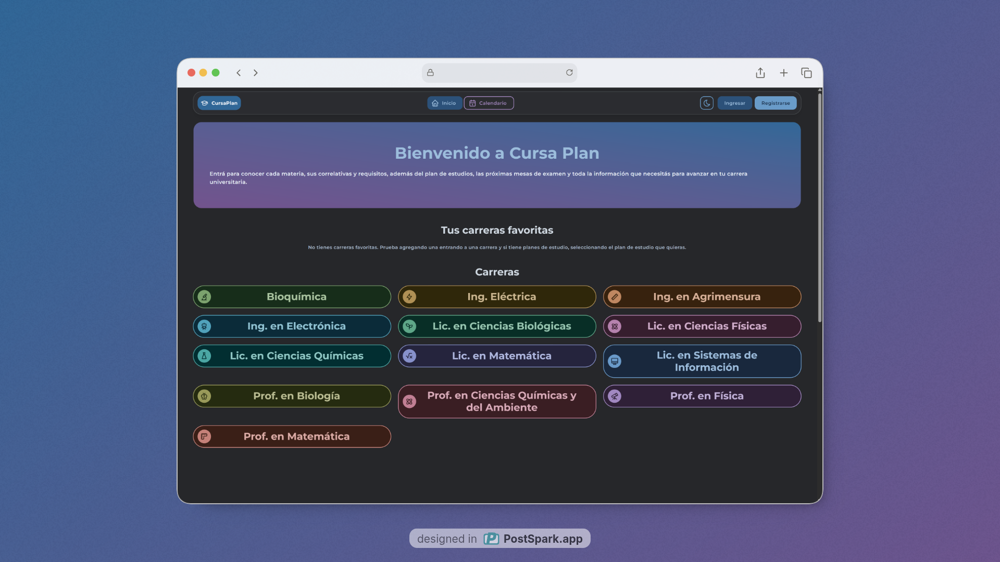

# cursa-plan-v3


**Cursa-plan** es una aplicación web que busca ayudar a los estudiantes de FaCENA - UNNE en su cursada.



## ✨ Características Principales

* **Exploración de Carreras:** Visualización detallada de carreras y sus planes de estudio.
* **Gestión de Materias:** Información sobre correlativas, régimen de cursada y estado de aprobación.
* **Sistema de Favoritos:** Los usuarios autenticados pueden guardar sus carreras y planes preferidos para acceso rápido.
* **Calendario Académico:** Visualización de feriados y fechas importantes de exámenes.
* **Autenticación de Usuarios:** Sistema de Login y Registro seguro mediante Supabase Auth.
* **Modo Oscuro/Claro:** Interfaz adaptable a la preferencia del usuario.
* **Diseño Responsivo:** Funciona perfectamente en dispositivos móviles y escritorio.

## 🛠️ Tecnologías Utilizadas

* **Frontend:** React (v18) + TypeScript.
* **Build Tool:** Vite.
* **Estilos:** Tailwind CSS + Tabler Icons.
* **Routing:** React Router DOM.
* **Backend & Base de Datos:** Supabase (PostgreSQL + Auth).

## 🚀 Instalación y Configuración

Sigue estos pasos para correr el proyecto localmente:

### 1. Clonar el repositorio

```bash
git clone https://github.com/tu-usuario/cursa-plan-v3.git
cd cursa-plan-v3
```
### 2. Instalar dependencias
Asegúrate de tener Node.js instalado.
```bash
npm install
```
### 3. Configurar Variables de Entorno
Crea un archivo .env en la raíz del proyecto basándote en .env.example (si existe) o agrega tus credenciales de Supabase:

```bash
VITE_SUPABASE_URL=tu_url_de_supabase
VITE_SUPABASE_ANON_KEY=tu_anon_key_de_supabase
```
### 4. Ejecutar el servidor de desarrollo
```bash
npm run dev
```
La aplicación estará corriendo en `http://localhost:5173`.

## 📂 Estructura del Proyecto
`/src/components`: Componentes reutilizables (Botones, Cards, Inputs).

`/src/pages`: Vistas principales (Home, Carrera, Materia, Login).

`/src/sections`: Secciones grandes de la UI (Hero, Listados).

`/src/context`: Manejo de estado global (AuthContext).

`/src/utils`: Utilidades y configuración de Supabase.

## 🤝 Contribución
¡Las contribuciones son bienvenidas! Si tienes ideas para mejorar CursaPlan:

1. Haz un Fork del proyecto.
2. Crea una rama para tu feature (`git checkout -b feature/NuevaFuncionalidad`).
3. Haz Commit de tus cambios (`git commit -m 'Agregado nueva funcionalidad'`).
4. Haz Push a la rama (`git push origin feature/NuevaFuncionalidad`).
5. Abre un Pull Request.

Hecho con ❤️ por Matias Solis Schneeberger

## 📜 Historia del Proyecto
Esta es la versión v3 de CursaPlan. Las iteraciones anteriores fueron desarrolladas en Astro. Aunque Astro es una tecnología excelente, la necesidad de una mayor interactividad y manejo de estado complejo motivó la migración completa a React (SPA) para esta versión.